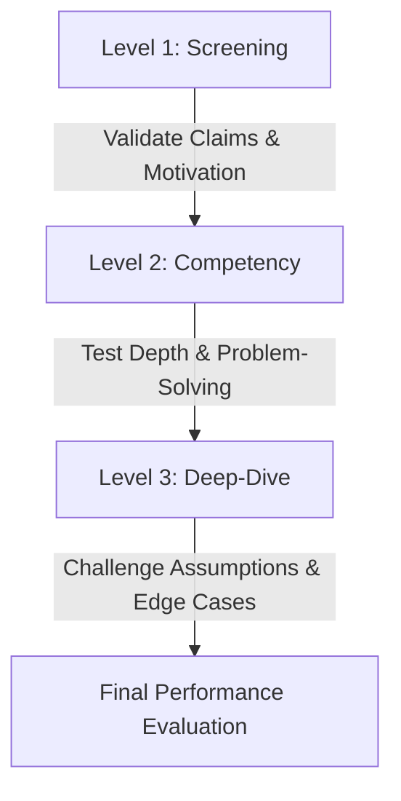

# 🎓 Virtual & AI Interview Mastery Guide

Welcome to the **Virtual & AI Interview Mastery Guide**. This comprehensive guide is designed to help you prepare, practice, and excel in modern virtual and AI-conducted interviews.

---

## 📑 Table of Contents
1. [The 3-Level Interview Architecture](#1-the-3-level-interview-architecture)
2. [Answering Frameworks](#2-answering-frameworks)
   - [STAR Method (Behavioral & Experience)](#the-star-method)
   - [PREP Framework (Opinion & Thought Leadership)](#the-prep-framework)
   - [CARL Framework (Growth & Challenges)](#the-carl-framework)
3. [Mastering the 7 Core Competencies](#3-mastering-the-7-core-competencies)
4. [Virtual & Voice Dynamics](#4-virtual--voice-dynamics)
5. [Overcoming "Under-Evidenced" Answers](#5-overcoming-under-evidenced-answers)
6. [Handling Difficult & Deep-Dive Questions](#6-handling-difficult--deep-dive-questions)
7. [Pre-Interview Checklist & Practice Prompts](#7-pre-interview-checklist--practice-prompts)

---

## 1. The 3-Level Interview Architecture

AI and modern interviewers evaluate candidates across three progressive stages:



### Level 1: Screening (Broad & Foundation)
* **Goal**: Verifies resume claims, background alignment, and role motivation.
* **Key Focus**: Communication clarity, enthusiasm, concise professional summary.
* **Sample Question**: *"Walk me through a key project on your resume and why this role is the natural next step for you."*

### Level 2: Competency (Practical Depth)
* **Goal**: Assesses technical capability, problem-solving methodologies, and behavioral execution.
* **Key Focus**: Practical knowledge, architecture decisions, trade-offs, and teamwork.
* **Sample Question**: *"Describe a situation where a system or project failed to meet performance standards. How did you diagnose and resolve the bottleneck?"*

### Level 3: Deep-Dive (Stress & Edge Cases)
* **Goal**: Probes ambiguities, tests reasoning limits, and evaluates adaptability under pressure.
* **Key Focus**: Handling edge cases, scale constraints, defending architectural decisions, and learning from failure.
* **Sample Question**: *"If your dataset grew by 100x overnight, where would your proposed solution break first, and what trade-offs would you make to sustain throughput?"*

---

## 2. Answering Frameworks

Structure is the single most important factor in interview clarity.

### The STAR Method
Use for: **Behavioral, experience, and situational questions.**

| Component | Description | Time Split | Example |
| :--- | :--- | :--- | :--- |
| **S — Situation** | Set the context (company, team, problem). | 15% | *"At my previous role, our batch data processing pipeline was experiencing a 4-hour delay during peak traffic."* |
| **T — Task** | What was your exact objective/responsibility? | 15% | *"I was tasked with reducing processing latency below 30 minutes without increasing cloud infrastructure costs."* |
| **A — Action** | Specific technical & strategic actions **you** took. | 50% | *"I profiled the query execution plan, identified redundant table scans, implemented asynchronous worker queues with Redis, and added composite indexing."* |
| **R — Result** | Quantifiable business & technical outcomes. | 20% | *"Pipeline execution time dropped from 4 hours to 18 minutes (an 85% improvement), saving ~$1,200/month in compute costs."* |

---

### The PREP Framework
Use for: **Opinion, approach, or rapid-response questions.**

* **Point (P)**: State your main thesis clearly in one sentence.
* **Reason (R)**: Explain the rationale or principle behind your point.
* **Example (E)**: Provide a concrete reference or case study.
* **Point (P)**: Reiterate the takeaway and tie it back to the role.

---

### The CARL Framework
Use for: **Failures, lessons learned, and conflict resolution.**

* **Context**: What was happening?
* **Action**: What did you do?
* **Result**: What was the immediate outcome?
* **Learning**: What insight did you gain and how do you apply it today?

---

## 3. Mastering the 7 Core Competencies

AI and executive interviewers assess performance across 7 dimensions:

```
┌───────────────────────────┬────────────────────────────────────────────────────────┐
│ Competency                │ What Strong Answers Demonstrate                        │
├───────────────────────────┼────────────────────────────────────────────────────────┤
│ 1. Role Fit               │ Clear understanding of team deliverables and mission   │
│ 2. Technical Knowledge    │ Accurate terminology, underlying mechanics, frameworks │
│ 3. Problem Solving        │ First-principles thinking, root-cause diagnosis        │
│ 4. Communication          │ Structured, concise, free of jargon or fluff           │
│ 5. Confidence             │ Decisive delivery, clear ownership ("I did" vs "we")   │
│ 6. Depth of Understanding │ Trade-off analysis, edge-case awareness, scaling limits│
│ 7. Behavioural Fit        │ Collaborative mindset, high agency, emotional maturity │
└───────────────────────────┴────────────────────────────────────────────────────────┘
```

---

## 4. Virtual & Voice Dynamics

In AI and video interviews, your audio-visual delivery directly influences your score:

### 1. Speaking Pace & Cadence
* **Target Speed**: 125 – 150 Words Per Minute (WPM).
* **Pause Strategy**: Use 2-second deliberate pauses before answering rather than filler words.
* **Eliminate Fillers**: Avoid *"um", "uh", "like", "you know", "basically", "actually"*.

### 2. Audio & Video Setup
* **Eye Line**: Align your webcam at eye level (look at the camera lens, not the screen center).
* **Lighting**: Front lighting (key light behind the monitor). Avoid backlighting from windows.
* **Audio**: Use a dedicated headset or directional microphone to eliminate echo.

---

## 5. Overcoming "Under-Evidenced" Answers

The most common reason strong candidates fail is being **under-evidenced**, not underqualified.

### The Contrast: Weak vs Strong Answers

#### Example: Database Optimization
* ❌ **Under-evidenced**: *"I have good experience with databases and helped speed up our application queries so users were happy."*
* ✅ **Evidence-backed**: *"I diagnosed high P99 API latencies by profiling slow queries in PostgreSQL. I restructured three N+1 queries, introduced Redis caching for read-heavy sessions, and cut average latency from 480ms to 65ms under peak load."*

#### Example: Leadership & Initiative
* ❌ **Under-evidenced**: *"I am a team player who collaborated with cross-functional teams to deliver sprints on time."*
* ✅ **Evidence-backed**: *"When our payment gateway migration fell two weeks behind schedule, I facilitated daily standups between engineering and compliance, decoupled the non-critical webhook handlers, and delivered the core checkout on the original launch date."*

---

## 6. Handling Difficult & Deep-Dive Questions

### When you don't know the exact answer:
1. **Acknowledge and pivot to reasoning**:
   > *"I haven't worked with that specific tool in production, but based on my experience with similar distributed architectures like X, I would approach this by..."*
2. **Think out loud**:
   Walk the interviewer through your problem breakdown:
   - Identify constraints (latency vs throughput, memory vs compute).
   - Formulate hypotheses.
   - Propose a test or evaluation method.

### When asked about a major mistake or failure:
* Never choose a fake weakness (*"I'm too perfectionist"*).
* Choose a real technical or workflow challenge where you took ownership, fixed the issue, and implemented a safeguard (e.g., CI/CD automation, unit tests, fallback alerts) so it never happened again.

---

## 7. Pre-Interview Checklist & Practice Prompts

### 30-Minute Pre-Interview Checklist
- [ ] **Tech Check**: Webcam, microphone, and browser permissions tested.
- [ ] **JD Refresh**: Review the top 3 required skills and prepare 1 STAR story for each.
- [ ] **Key Metrics**: Memorize 3-5 concrete numbers (e.g., % improvement, revenue, latency, users).
- [ ] **STAR Stories**: Prepare 4 versatile stories (1 technical win, 1 system failure/recovery, 1 leadership/conflict, 1 rapid learning experience).

---

### Practice Prompts for the AI Interview Accelerator

Run these prompts through your local AI Interview Accelerator:

1. *"Tell me about a time you had to balance code quality with a tight delivery deadline."*
2. *"How do you approach debugging an intermittent issue that only reproduces in production?"*
3. *"Describe an architectural decision you made that you would do differently today."*
4. *"How do you handle disagreement with a peer or senior engineer on technical direction?"*
5. *"Walk me through the lifecycle of a request in your most recent project from client to database."*

---

> **Tip**: Practice using the voice microphone on [http://localhost:8000](http://localhost:8000) to get real-time feedback on your words-per-minute, filler word count, and adaptive question difficulty!
